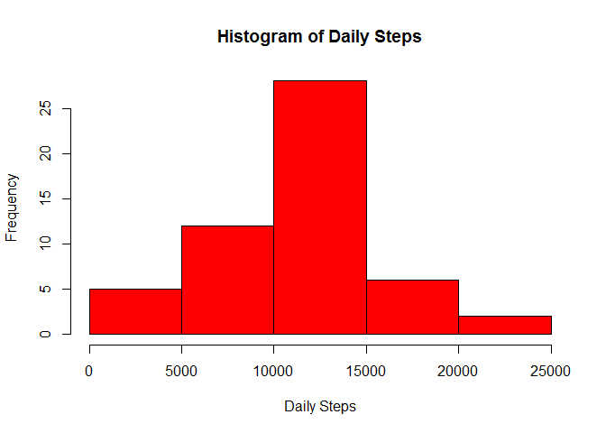
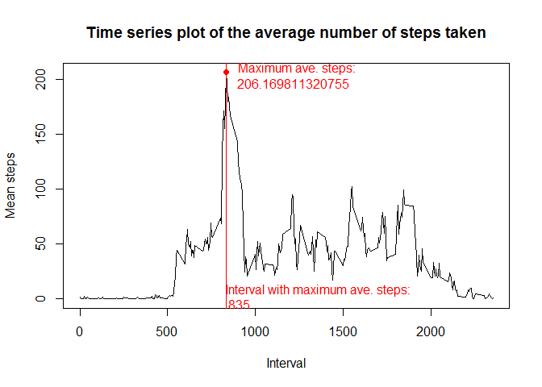
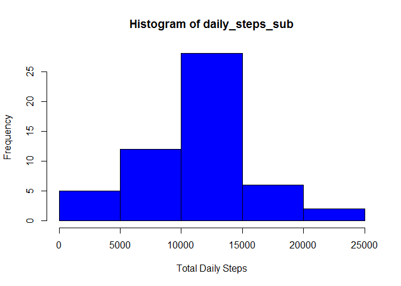

# Reproducible Research: Peer Assessment 1

[github.com/TribeTect, July 2015]

## 1. Loading and preprocessing the data

```r
activity <- read.csv(unz("activity.zip", "activity.csv"))
activity[["date"]] <- as.Date(activity[["date"]], "%Y-%m-%d")
str(activity)
```

```
## 'data.frame':	17568 obs. of  3 variables:
##  $ steps   : int  NA NA NA NA NA NA NA NA NA NA ...
##  $ date    : Date, format: "2012-10-01" "2012-10-01" ...
##  $ interval: int  0 5 10 15 20 25 30 35 40 45 ...
```

## 2. What is mean total number of steps taken per day?

```r
activity2 <- activity[complete.cases(activity),] # ignoring NA observations for this part of the assignment
daily_steps <- tapply(X = activity2$steps,INDEX = activity2$date, FUN = "sum")
mean(daily_steps)
```

```
## [1] 10766.19
```

### 2.1 Total number of steps per day:
(showing first 20 daily totals)

```r
head(daily_steps, 20)
```

```
## 2012-10-02 2012-10-03 2012-10-04 2012-10-05 2012-10-06 2012-10-07 
##        126      11352      12116      13294      15420      11015 
## 2012-10-09 2012-10-10 2012-10-11 2012-10-12 2012-10-13 2012-10-14 
##      12811       9900      10304      17382      12426      15098 
## 2012-10-15 2012-10-16 2012-10-17 2012-10-18 2012-10-19 2012-10-20 
##      10139      15084      13452      10056      11829      10395 
## 2012-10-21 2012-10-22 
##       8821      13460
```

### 2.2 Histogram of steps per day:

```r
hist(daily_steps)
```

 

```r
mean_daily_steps <- mean(daily_steps)
median_daily_steps <- median(daily_steps)
cat("Mean Daily Steps: ", mean_daily_steps, "\n")
```

```
## Mean Daily Steps:  10766.19
```

```r
cat("Median Daily Steps: ", median_daily_steps, "\n")
```

```
## Median Daily Steps:  10765
```
## 3. What is the average daily activity pattern?

### 3.1 Make a time series plot (i.e. type = "l") of the 5-minute interval (x-axis) and the average number of steps taken, averaged across all days (y-axis)
### 3.2 Which 5-minute interval, on average across all the days in the dataset, contains the maximum number of steps?


```r
interval_steps <- tapply(X = activity2$steps, INDEX = activity2$interval, FUN = "mean")

max_mean_steps <- as.data.frame(interval_steps[interval_steps == max(interval_steps)])
max_mean_x = row.names(max_mean_steps) 
max_mean_y = max_mean_steps[[1]]

plot(x = row.names(interval_steps), y = interval_steps, xlab = "Interval", ylab = "Mean steps", type = "l")
points(x = max_mean_x, y = max_mean_y, pch = 19, col = "red")
abline(v = max_mean_x, col = "red")
```

 

```r
cat("The interval with highest mean: ", max_mean_x)
```

```
## The interval with highest mean:  835
```

## 4. Imputing missing values
### 4.1 Report count of observations with NAs

```r
cat("4.1 Number of cases with NA values: ", sum(is.na(activity)))
```

```
## 4.1 Number of cases with NA values:  2304
```

### 4.2 Devise a strategy to replace missing values 
#### Missing values will be replaced with corresponding interval means, rounded off 

### 4.3 Create a new dataset with NA values replaced


```r
activity_sub <- activity #clone the dataset for replacing NAs

for(i in 1:nrow(activity_sub)) {
  if(is.na(activity_sub[i,1])) {#CONDITION TEST 1 - DOES THE OBS HAVE NAs
    interval_i <- as.character(activity_sub[i,3]) #get the interval
    mean_step_i <- interval_steps[interval_i] #get mean steps for interval
    activity_sub[i,1] <- round(as.numeric(mean_step_i)) #replace NA value 
      
  }
}
```
### 4.4 Histogram of daily steps, with new dataset, mean and median

```r
#re calculate daily steps
daily_steps_sub <- tapply(X = activity2$steps,INDEX = activity2$date, FUN = "sum")
hist(daily_steps_sub, xlab = "Total Daily Steps", col = "blue")
```

 

```r
mean_daily_steps_sub <- mean(daily_steps_sub)
median_daily_steps_sub <- median(daily_steps_sub)
cat("New mean: ", mean_daily_steps_sub, " Previous mean: ", mean_daily_steps, "\n" )
```

```
## New mean:  10766.19  Previous mean:  10766.19
```

```r
cat("New median: ", median_daily_steps_sub, " Previous mean: ", median_daily_steps, "\n")
```

```
## New median:  10765  Previous mean:  10765
```
#### QUESTION: Do these values differ from the estimates from the first part of the assignment? What is the impact of imputing missing data on the estimates of the total daily number of steps?
### ANSWER: Same mean and median shows no impact of imputing missing data on those measures


## 5. Are there differences in activity patterns between weekdays and weekends?
