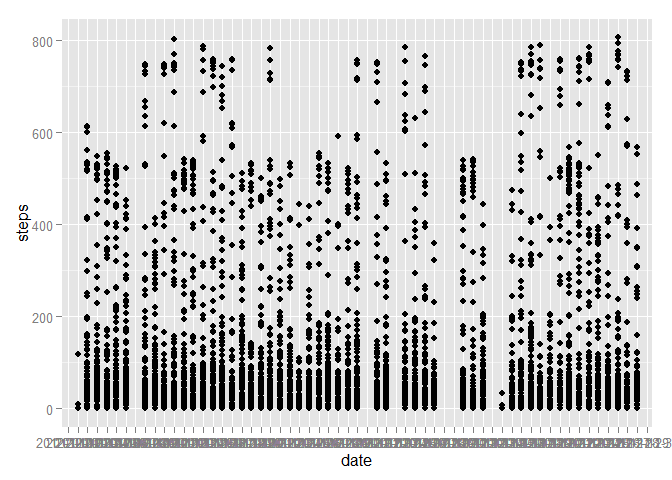

# Reproducible Research: Peer Assessment 1

[github.com/TribeTect, July 2015]

## Loading and preprocessing the data

```r
activity <- read.csv(unz("activity.zip", "activity.csv"))
str(activity)
```

```
## 'data.frame':	17568 obs. of  3 variables:
##  $ steps   : int  NA NA NA NA NA NA NA NA NA NA ...
##  $ date    : Factor w/ 61 levels "2012-10-01","2012-10-02",..: 1 1 1 1 1 1 1 1 1 1 ...
##  $ interval: int  0 5 10 15 20 25 30 35 40 45 ...
```

## What is mean total number of steps taken per day?

```r
require(ggplot2)
```

```
## Loading required package: ggplot2
```

```r
qplot(date, steps, data = activity)
```

```
## Warning in loop_apply(n, do.ply): Removed 2304 rows containing missing
## values (geom_point).
```

 


## What is the average daily activity pattern?


## Imputing missing values


## Are there differences in activity patterns between weekdays and weekends?
